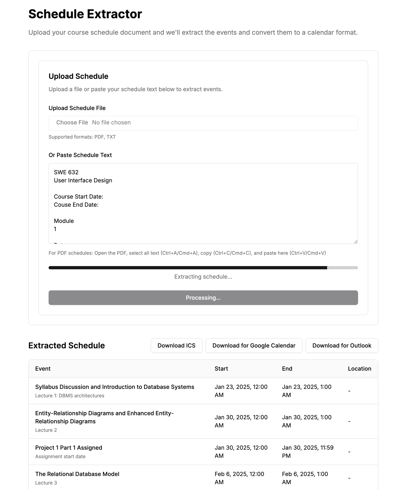

# Schedule Extractor


A modern web application that extracts schedule information from text or PDF files and converts them into calendar formats (ICS, Google Calendar, Outlook).

## Features

- Extract schedule information using OpenAI's GPT-4
- Support for text and PDF files
- Multiple calendar export formats:
  - ICS file (compatible with Apple Calendar, Outlook Desktop)
  - Google Calendar CSV
  - Outlook CSV
- Real-time progress indication
- Modern, responsive UI using Next.js and Tailwind CSS
- Toast notifications for user feedback

## Tech Stack

- Next.js 14 with App Router
- TypeScript
- Tailwind CSS
- Shadcn/UI Components
- OpenAI GPT-4 API
- React Hook Form
- Zod for validation

## Getting Started

1. Clone the repository
2. Install dependencies:
   ```
   npm install
   ```
3. Create a `.env` file with your OpenAI API key:
   ```
   OPENAI_API_KEY=your_api_key_here
   ```
4. Run the development server:
   ```
   npm run dev
   ```

## Usage

1. Upload a schedule file (TXT, PDF) or paste schedule text
2. Click "Extract Schedule"
3. Review the extracted schedule in the table
4. Choose your preferred calendar format:
   - Download ICS file
   - Download for Google Calendar
   - Download for Outlook

## File Structure

```
schedule-ics/
├── app/
│   ├── api/
│   │   └── completion/
│   │       └── route.ts    # OpenAI API integration
│   ├── layout.tsx          # Root layout
│   └── page.tsx           # Main page
├── components/
│   ├── file-upload.tsx    # File upload form
│   ├── schedule-preview.tsx # Schedule preview table
│   └── ui/                # UI components
├── lib/
│   ├── utils.ts           # Utility functions
│   └── ics.ts            # ICS file generation
└── types/
    └── ics-js.d.ts       # Type definitions
```

## API Integration

The application uses OpenAI's GPT-4 to extract schedule information. The API endpoint expects text input and returns structured event data:

```typescript
interface ScheduleEvent {
  title: string;
  startDate: string;
  endDate: string;
  location?: string;
  description?: string;
  recurrence?: string;
}
```

## Calendar Export Formats

1. ICS File:

   - Universal calendar format
   - Compatible with most calendar applications
   - Includes all event details

2. Google Calendar CSV:

   - Format: Subject, Start Date, End Date, Description, Location
   - Import via Google Calendar's import feature

3. Outlook CSV:
   - Similar format to Google Calendar
   - Import directly into Outlook

## UI Components

1. File Upload Form:

   - File input for TXT/PDF files
   - Text area for pasted content
   - Progress indicator during extraction
   - Form validation

2. Schedule Preview:
   - Responsive table layout
   - Sticky header
   - Event details display
   - Export options

## Error Handling

- Input validation
- API error handling
- File reading errors
- Toast notifications for user feedback

## Best Practices

- TypeScript for type safety
- Server-side API key protection
- Proper error handling
- Loading states
- Form validation
- Responsive design
- Accessibility features

## Limitations

- PDF text extraction requires manual copy-paste
- Calendar export formats are basic CSV/ICS
- Limited to text-based schedules

## Future Improvements

1. Enhanced PDF Support:

   - Direct PDF parsing
   - OCR capabilities

2. Additional Features:

   - Custom date format support
   - Recurring event patterns
   - Batch processing
   - Calendar sync APIs

3. UI Enhancements:
   - Dark mode
   - Custom themes
   - Mobile optimization
   - Drag-and-drop support

## Contributing

1. Fork the repository
2. Create a feature branch
3. Commit your changes
4. Push to the branch
5. Create a Pull Request

## License

MIT License
